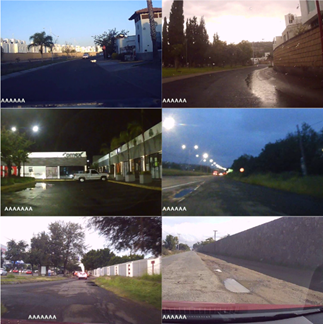
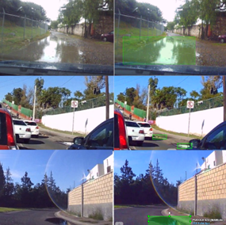
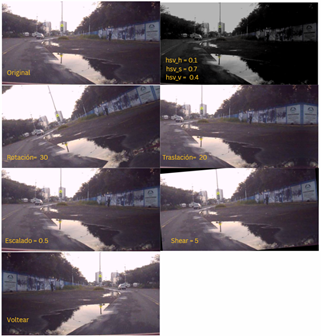
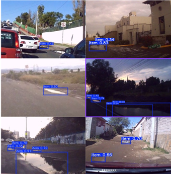
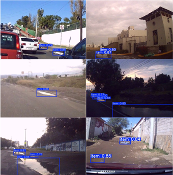

# 🛣️ Water-Puddle Detection on Roads Using YOLO

This repository presents a computer-vision system for detecting water puddles on roads using deep-learning object-detection models based on the YOLO family. The project focuses on real-world driving scenarios in Mexico and aims to support future driver-assistance and autonomous-driving systems.

## 🧩 Pipeline

```mermaid
flowchart LR
  A[Route Video Capture<br/>Dashcam @ 1280x720, 30fps] --> B[Frame Extraction<br/>Positive/Negative samples]
  B --> C[Dataset Curation<br/>Structured & Unstructured roads<br/>Day / Dusk / Night / Rain]
  C --> D[Annotation (CVAT)<br/>Bounding boxes: puddle]
  D --> E[YOLO Format Export<br/>labels/*.txt + images/*]
  E --> F[Split Dataset<br/>Train 70% / Val 15% / Test 15%]
  F --> G[Data Augmentation<br/>HSV + Rotate + Translate + Scale + Shear + Flip]
  G --> H[Training<br/>YOLOv5 / YOLOv8 / YOLOv11<br/>AdamW, 250 epochs, img=640]
  H --> I[Evaluation<br/>Precision, Recall, mAP@0.5]
  I --> J[Qualitative Analysis<br/>Detection examples + failure cases]
  J --> K[Deployment (Future)<br/>Jetson / Raspberry Pi (lite models)]


## 📌 Problem Statement

- Water puddles on roads can:
- Hide potholes and obstacles
- Increase the risk of hydroplaning
- Cause vehicle damage and accidents

Detecting these hazards in real time using cameras and deep learning can improve road safety and autonomous navigation.

## 🎯 Objectives

- Build a custom dataset of road images under diverse lighting and weather conditions
- Train and compare multiple YOLO versions (v5, v8, v11)
- Evaluate detection performance using Precision, Recall, and mAP@0.5
- Analyze strengths, weaknesses, and failure cases

## 📷 Dataset

The dataset was collected using an onboard dashboard camera mounted inside a moving vehicle to capture real-world driving conditions.

**Locations**
- Querétaro, Mexico  
- Guanajuato, Mexico  

**Road Types**
- Structured roads (paved streets and highways)  
- Unstructured roads (unpaved or damaged roads)  

**Classes**
- `puddle` (water concentration)

### Dataset Split

| Split | Images |
|------|--------|
| Training | 1112 |
| Validation | 238 |
| Test | 239 |

Images include a wide variety of lighting and weather conditions such as daylight, dusk, night, and rainy scenarios.

### Sample Images

Below are example images from the dataset under different lighting and road conditions:

<p align="center">
  
</p>
 
## 🏷️ Annotation

Images were labeled using CVAT, drawing bounding boxes around water puddles and exporting in YOLO format.

### Annotation Examples

Images were labeled using bounding boxes around water puddles.

<p align="center">
  
</p>

## 🔄 Data Augmentation

Applied to improve generalization:
- HSV color variations
- Rotation
- Translation
- Scaling
- Shear
- Horizontal flip

### Data Augmentation

The following examples illustrate color and geometric transformations applied during training:

<p align="center">
  
</p>

## 🧠 Models Evaluated

- YOLOv5
- YOLOv8
- YOLOv11

All models were trained under the same conditions.

## ⚙️ Training Setup

All models were trained under the same configuration to ensure a fair comparison.

| Parameter | Value |
|----------|-------|
| Epochs | 250 |
| Optimizer | AdamW |
| Learning Rate | 0.0001 |
| Batch Size | 32 |
| Image Size | 640 |

## 📊 Results

The following table summarizes the performance of the evaluated YOLO models.

| Model | Precision (%) | Recall (%) | mAP@0.5 (%) |
|------|---------------|-------------|--------------|
| YOLOv5 | 70.0 | 41.7 | 56.8 |
| YOLOv8 | **78.9** | 45.1 | **64.0** |
| YOLOv11 | 76.9 | **48.5** | 64.0 |

### Detection Examples

<p align="center">
  
  
  
</p>


**Best Precision:** YOLOv8  
**Best Recall:** YOLOv11  

YOLOv8 offers the best balance between accuracy and robustness, while YOLOv11 achieves higher recall but slightly lower precision.

## 🔍 Key Findings

- YOLOv8 provides the best overall balance between accuracy and robustness
- YOLOv11 shows stronger recall but slightly lower precision
- YOLOv5 struggles with large puddles and sometimes fragments detections

## ⚠️ Limitations

Missed detections under extreme reflections

Dataset size still limited for full generalization

Single class only (future extension possible)

## 🚀 Future Work

Expand dataset size and diversity

Explore segmentation models (e.g., YOLO-Seg, U-Net)

Real-time deployment on embedded systems (Jetson, Raspberry Pi)

Multi-class hazards (potholes, debris, flooded zones)

## 📄 Paper

Spanish version available in /paper/DeteccionDeConcentracionesdeAgua.pdf

## 👤 Authors

Miguel Trujillo Lopez;
Juan Manuel Ramos Arreguin;
Jesús Carlos Pedraza Ortega;
Saúl Tovar Arriaga;
Marco Antonio Aceves Fernández;
Karen Andrea Ramírez Arriaga;

## 🏫 Affiliation

Faculty of Engineering
Universidad Autónoma de Querétaro (UAQ)
Querétaro, Mexico
